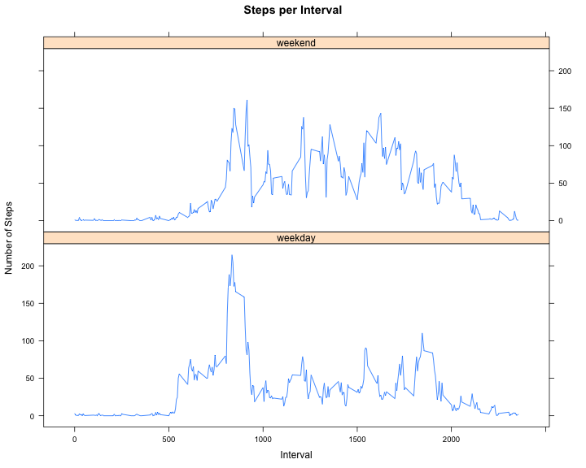

# Reproducible Research: Peer Assessment 1

## Loading and preprocessing the data

* set working directory 
* laod data


```r
setwd("~/Documents/SWE/udacity_coursera_edx/datasciencecoursera/RepData_PeerAssessment1/")
activity <- read.csv("activity.csv")
```


## What is mean total number of steps taken per day?


```r
steps_per_day <- aggregate(activity$steps, by=list(activity$date), sum)
names(steps_per_day) <- c("date", "steps")
```


```r
hist(steps_per_day$steps, xlab="Steps per Day", main="Histogram of Steps per Day")
```

 


```r
mean_steps <- mean(steps_per_day$steps, na.rm = TRUE)
median_steps <- median(steps_per_day$steps, na.rm = TRUE)
options(scipen=1, digits=1)
```

- **Mean** total number of steps taken per day: **10766.2**
- **Median** total number of steps taken per day: **10765**


## What is the average daily activity pattern?


```r
steps_per_interval <- aggregate(activity$steps, by=list(activity$interval), mean, na.rm = TRUE)
names(steps_per_interval) <- c("interval", "steps")
```


```r
plot(x=steps_per_interval$interval, y=steps_per_interval$steps, type="l",
     xlab="Interval ID", ylab="Steps", main="Daily Activity")
```

 


```r
top_id <- steps_per_interval$interval[steps_per_interval$steps==max(steps_per_interval$steps)]
```
The **Top ID**, i.e. the ID of the 5-minute interval, which on average across all the days in the dataset, contains the maximum number of steps is **835**.


## Imputing missing values 
### first version, with simple strategy 


```r
missing <- sum(is.na(activity$steps))
all <- length(activity$steps)
```
The total number of **missing values** is **2304**.

In the total of all 17568 observations this is 13.1%.

The probabliy simplest strategy for filling in missing valuesis 
is to replace all NAs by one value. Here I choose 0. 


```r
quickfix <- activity
quickfix[is.na(quickfix)] <- 0

qfsteps_per_day <- aggregate(quickfix$steps, by=list(quickfix$date), sum)
names(qfsteps_per_day) <- c("date", "steps")
```


```r
hist(qfsteps_per_day$steps, xlab="Steps per Day", main="Histogram of Steps per Day")
```

 

The added 0 values **blow up the left bar** in the histogram, which contains the 0 Steps per Day.


```r
mean_qfsteps <- mean(qfsteps_per_day$steps)
median_qfsteps <- median(qfsteps_per_day$steps)
options(scipen=1, digits=1)
```

And the added 0 values **draw down the mean and the median**. 

Before fix

- **Mean** total number of steps taken per day: **10766.2**
- **Median** total number of steps taken per day: **10765**

**After (simple) fix**

- **Mean** total number of steps taken per day: **9354.2**
- **Median** total number of steps taken per day: **10395**


## Imputing missing values 
### second version, with more sophisticated strategy 

Just to remember,
the total number of **missing values** is **2304**.

In the total of all 17568 observations this is 13.1%.

Now lets fill in the missing values with a more sophisticated strategy: 


```r
sophfix <- activity

fix <- function(date, interval) {
    intervals_per_day <- 12 * 24
    fix_spi <- steps_per_interval
    fix_spi[is.na(fix_spi)] <- mean_steps / intervals_per_day
    
    fix_spd <- steps_per_day
    fix_spd[is.na(fix_spd)] <- mean_steps
    
    proposal1 <- fix_spi$steps[which(fix_spi$interval == interval)]
    proposal2 <- fix_spd$steps[which(fix_spd$date == date)] / intervals_per_day
    
    return(sqrt(proposal1 * proposal2))
}

for(idx in 1:length(sophfix$steps)) {
    if(is.na(sophfix$steps[idx])) {
        sophfix$steps[idx] <- fix(sophfix$date[idx], sophfix$interval[idx])
    }
}

sfsteps_per_day <- aggregate(sophfix$steps, by=list(sophfix$date), sum)
names(sfsteps_per_day) <- c("date", "steps")
```


```r
hist(sfsteps_per_day$steps, xlab="Steps per Day", main="Histogram of Steps per Day")
```

 

Now the added values **increase the second bar** in the histogram (5000 .. 10000 Steps per Day).


```r
mean_sfsteps <- mean(sfsteps_per_day$steps)
median_sfsteps <- median(sfsteps_per_day$steps)
options(scipen=1, digits=1)
```

And they also **draw down the mean and the median**. 

Before fix

- **Mean** total number of steps taken per day: **10766.2**
- **Median** total number of steps taken per day: **10765**

After simple fix

- **Mean** total number of steps taken per day: **9354.2**
- **Median** total number of steps taken per day: **10395**

**After sophisticted fix**

- **Mean** total number of steps taken per day: **10528.4**
- **Median** total number of steps taken per day: **10395**


## Are there differences in activity patterns between weekdays and weekends?


```r
weekend <- c("Saturday", "Sunday")
sophfix$day <- factor(weekdays(as.Date(sophfix$date)) %in% weekend, labels=c("weekday", "weekend"))

steps_per_interval <- aggregate(sophfix$steps, by=list(sophfix$interval, sophfix$day), mean)
names(steps_per_interval) <- c("interval", "day", "steps")
```


```r
library(lattice) 
```


```r
xyplot(steps~interval|day, steps_per_interval,
   type = "l",
   main="Steps per Interval", 
   ylab="Number of Steps", xlab="Interval",
   layout=c(1,2))
```

 

- On **Weekends**, there is no strong peak and the values are higher then on weekdays.
- On **Weekdays**, there is a peak in the morning (when people go to work?).

Mean and Medaian confirm this.


```r
mean_ad <- mean(steps_per_interval$steps)
mean_wd <- mean(steps_per_interval$steps[steps_per_interval$day == "weekday"])
mean_we <- mean(steps_per_interval$steps[steps_per_interval$day == "weekend"])
median_ad <- median(steps_per_interval$steps)
median_wd <- median(steps_per_interval$steps[steps_per_interval$day == "weekday"])
median_we <- median(steps_per_interval$steps[steps_per_interval$day == "weekend"])
```

Steps | all  | weekdays | weekend
----- | ---- | -------- | -------
mean  | 38.2| 34.8 | 41.6 
median | 28.1| 25.5| 32.4


<hr>
<a href="#top">top</a>

